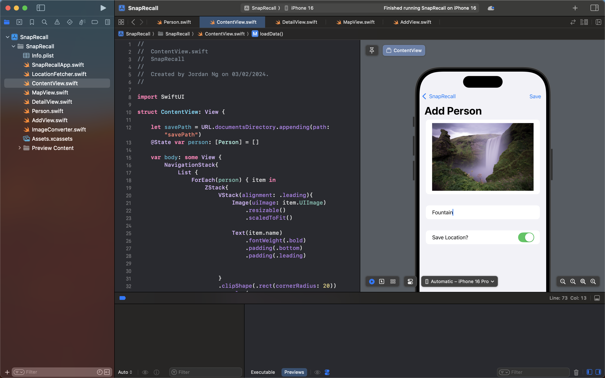
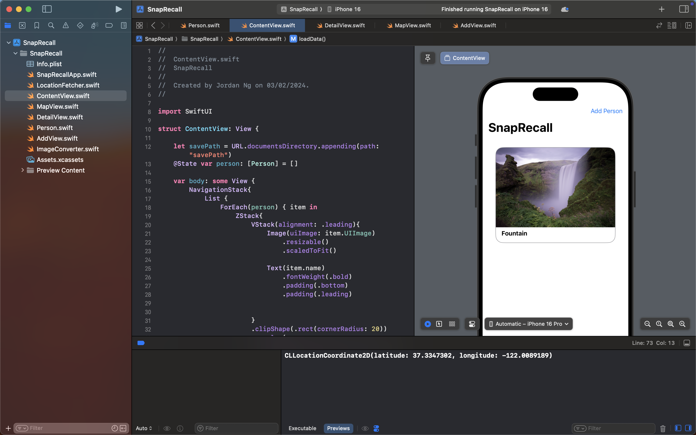
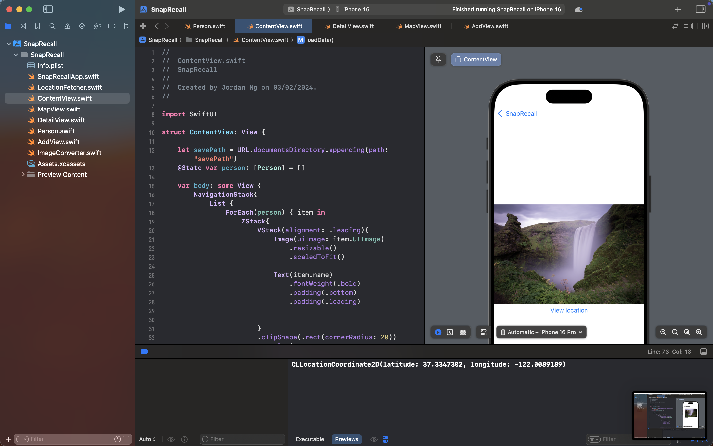
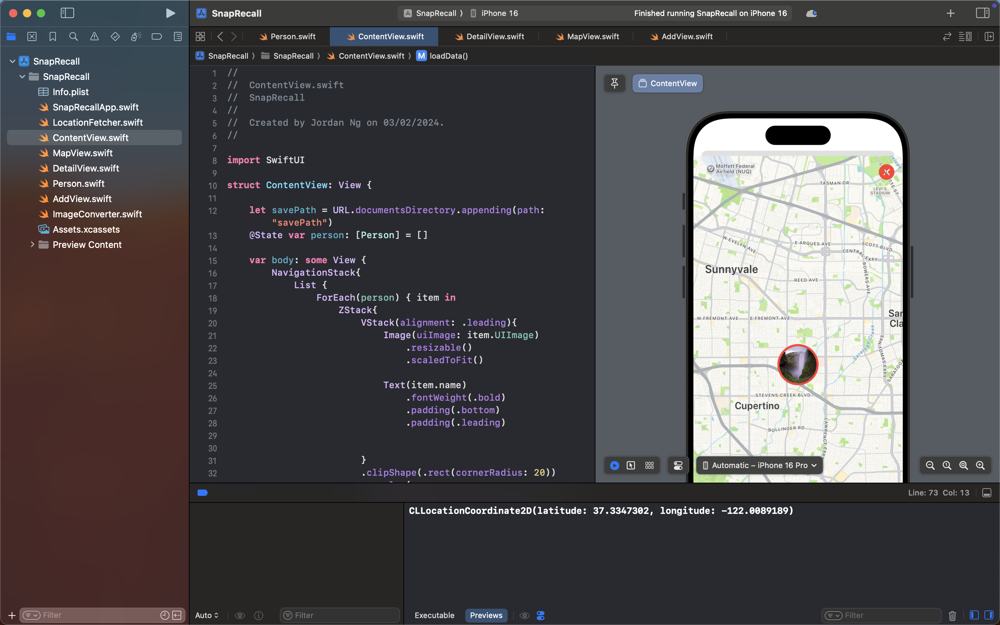

## Snap ReCall

A mini IOS Development Project using MapKit, PhotosUI and other built-in frameworks

## Why?

This application is designed for personal use, enabling users to quickly capture an image of a person or entity and assign a title to it. It helps users to quickly recall names of people they've met in the past. Inspired by BeReal and Gallery app, as it also stores the location data when a photo is saved for added context.

